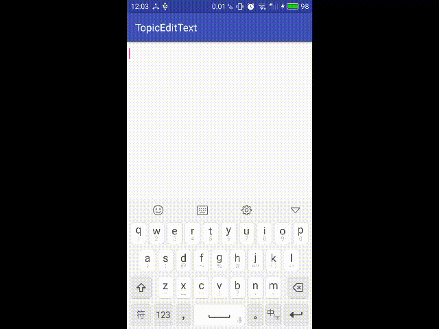
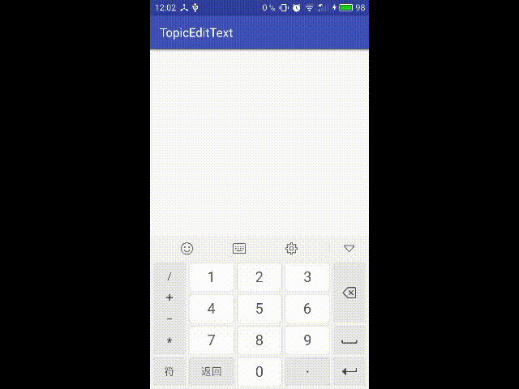

# LTextView
TextView文字对齐. eg,"用户名"和"密码"对齐

# TopicEditText
类似微博的话题，可以指定标记话题的符号（默认为#）和话题字体颜色（默认为蓝色）

        editText.setColorTopic(0xFFFF0000);
        editText.setTopicChar('*');
        
 可添加输入话题符号的监听（仅开始时）使用场景：某些特定话题可以通过用户选择的方式添加
 
 eg.“123”->"123\*"监听被触发;"123\*45"->"123\*45\*"监听不被触发
 
 
        editText.setOnTopicStartListener(new TopicEditText.OnTopicStartListener() {
            @Override
            public void topicStart() {
                //editText.getText().append("asdf").append(editText.getTopicChar());
                editText.appendTopic("CharacterSequence user selected");
            }
        });

